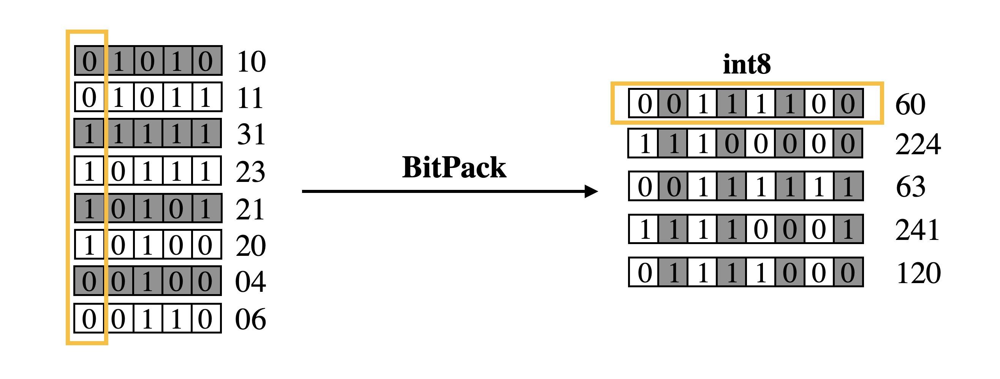

# BitPack

BitPack is a practical tool that can efficiently save quantized neural network models with mixed bitwidth.

## Installation

* [PyTorch](http://pytorch.org/) version >= 1.4.0
* Python version >= 3.5
* **To install Bitpack** simply run:
```
git clone https://github.com/Zhen-Dong/BitPack.git
cd BitPack
```

## Usage
  
* We can use BitPack pack.py to save integer checkpoints with various bitwidth, and use BitPack unpack.py to load the packed checkpoint, as shown in the demo.
* To pack integer values that are saved in floating point format, add --force-pack-fp in the command.
* To directly save packed checkpoint in PyTorch, please use save_quantized_state_dict() and load_quantized_state_dict() in pytorch_interface.py. If you don't want to operate jointly on state_dict, then codes inside the for loop of those two functions can be applied on every quantized tensor (ultra low-precision integer tensors) in various quantization frameworks.
<p align="center">
  
  <br />
  <br />
  </p>


## Quick Start
BitPack is handy to use on various quantization frameworks. Here we show a demo that applying BitPack to save mixed-precision model generated by [HAWQ](https://github.com/Zhen-Dong/HAWQ).
```
export CUDA_VISIBLE_DEVICES=0
python pack.py --input-int-file quantized_checkpoint.pth.tar --force-pack-fp
python unpack.py --input-packed-file packed_quantized_checkpoint.pth.tar --original-int-file quantized_checkpoint.pth.tar
```
To get a better sense of how BitPack works, we provide a simple test that compares the original tensor, the packed tensor, and the unpacked tensor in details.
```
cd bitpack
python bitpack_utils.py
```

### Results of BitPack on ResNet50
Original Precision | Quantization | Original Size(MB) | Packed Size(MB) | Compression Ratio
---|----|---|---|---
Floating Point | Mixed-Precision(4bit/8bit) | 102 | 13.8 | 7.4x
8-bit | Mixed-Precision(2bit/8bit)          | 26  | 7.9  | 3.3x

### Special Notes
* unpack.py can be used for checking correctness. It loads and unpacks the packed model, and then compares it with the original model.

## License
THIS SOFTWARE WAS DEPOSITED IN THE BAIR OPEN RESEARCH COMMONS REPOSITORY ON FEB 1, 2023.

BitPack is released under the [MIT license](LICENSE).
